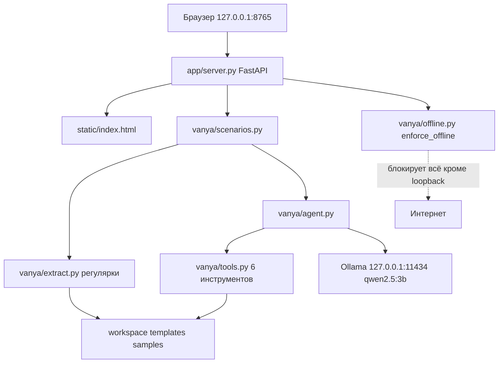

# AGENTS.md — как устроен проект и как его улучшать

> Файл для ИИ-агентов и людей-контрибьюторов. Прочитал за 5 минут — понял, что это,
> как работает и куда можно вмешиваться. Архитектурный контракт живёт в `SPEC.md`.

## Что это

«Ваня» — локальный офлайн ИИ-агент для юриста. Устанавливается на обычный ноутбук,
работает без интернета, обрабатывает документы под NDA и персональные данные, не
отправляя их наружу. Демо для акселератора 2026. Подробнее об идее — `docs/00 Обзор идеи.md`.

## Быстрый старт

```bash
uv venv --python 3.12 .venv
uv pip install --python .venv/bin/python -e ".[dev]"
ollama pull qwen2.5:3b
.venv/bin/python -m pytest tests -q
./run.sh
```

Ожидаемо: тесты зелёные (на заглушках, без Ollama), затем сервер отвечает на
`http://127.0.0.1:8765`. Отсутствие Ollama не ломает приложение: детерминированные
сценарии работают, LLM-сценарии честно деградируют. Полная установка одной командой —
`./install.sh` (флаг `--skip-model` пропускает скачивание модели).

## Карта репозитория

| Путь | Назначение |
|---|---|
| `vanya/` | Ядро: LLM-клиент, инструменты, агентский цикл, сценарии, извлечение реквизитов |
| `app/` | Веб-слой: FastAPI (`server.py`) и одна локальная страница (`static/index.html`) |
| `scripts/` | Проверка ресурсов, генератор шаблона договора, тестовые данные |
| `templates/` | Шаблон `dogovor_template.docx` с плейсхолдерами `{{ключ}}` |
| `samples/` | Тестовый пакет: паспорт, реквизиты организации, договор с рисками |
| `tests/` | 103 теста, Ollama не требуется |
| `docs/` | Пояснительные заметки (копия из Obsidian, источник истины в хранилище) |
| `SPEC.md` | Замороженный контракт интерфейсов. Менять только осознанно |

Модули ядра:

| Файл | Что делает |
|---|---|
| `vanya/config.py` | `Config` и `load_config()` — env-настройки, пути |
| `vanya/offline.py` | `enforce_offline()` — запрет сокетов вне loopback |
| `vanya/llm.py` | Клиент Ollama: `chat`, `stream`, `json_chat`, `health` |
| `vanya/docs.py` | Чтение txt/md/docx/pdf, заполнение docx по `{{ключ}}` |
| `vanya/extract.py` | `FIELDS`, `extract_requisites()` — только регулярки, без LLM |
| `vanya/tools.py` | 6 инструментов агента, `tool_schemas()`, `dispatch()` |
| `vanya/agent.py` | Цикл агента: `chat` → tool calls → наблюдения → ответ |
| `vanya/scenarios.py` | Три сценария: `fill_contract`, `find_risks`, `ask` |
| `vanya/prompts.py` | Русские системные промпты |

## Архитектура в 10 строках

Браузер открывает локальную страницу. FastAPI принимает файлы в рабочую папку.
Сценарий читает документы, детерминированная часть извлекает реквизиты регулярками,
LLM-часть идёт в Ollama на `127.0.0.1:11434`. Агентный чат сам решает, какой из
шести инструментов вызвать. Наружу не уходит ни один запрос.



## Инварианты, которые нельзя ломать

1. **Ни одного запроса вне loopback.** `enforce_offline()` патчит `socket` и активен по
   умолчанию. Это главное обещание продукта, а не деталь реализации.
2. **Детерминированные сценарии работают без LLM.** Извлечение реквизитов и заполнение
   договора не должны зависеть от модели. Иначе демо на слабой машине развалится.
3. **Тесты не требуют Ollama.** LLM всегда замокана. Тест, которому нужен живой Ollama,
   сломает CI и чужую машину.
4. **Никаких тяжёлых зависимостей.** Без torch, transformers, numpy. Суммарный вес
   зависимостей держим до 150 МБ: продукт ставится на 8 ГБ ОЗУ.
5. **Модель по умолчанию `qwen2.5:3b`**, переключается через `VANYA_MODEL`.
6. **Интерфейсы из `SPEC.md` §2 заморожены.** Меняешь сигнатуру — правь SPEC.md в том же
   коммите, иначе параллельные агенты и фронтенд разъедутся.
7. **Фронтенд без CDN и внешних шрифтов.** Любая внешняя ссылка ломает офлайн и
   проваливает `test_server.py`.

## Как добавить новый инструмент агента

1. Написать функцию в `vanya/tools.py`, которая принимает простые аргументы и возвращает
   словарь. Исключения она бросать не должна.
2. Описать `Tool(name, description, parameters, fn)`: `description` по-русски (его читает
   модель), `parameters` это JSON Schema.
3. Добавить `Tool` в список `TOOLS`.
4. Покрыть тестами в `tests/test_tools.py`, включая путь с ошибкой.
5. Если инструмент нужен и в UI: добавить сценарий в `vanya/scenarios.py`, endpoint в
   `app/server.py` и карточку в `app/static/index.html`.

Скелет:

```python
def _count_words(filename: str) -> dict:
    text = docs.read_document(load_config().workspace / filename)
    return {"words": len(text.split())}

Tool(
    name="count_words",
    description="Посчитать число слов в документе.",
    parameters={
        "type": "object",
        "properties": {"filename": {"type": "string"}},
        "required": ["filename"],
    },
    fn=_count_words,
)
```

## Как добавить новый сценарий

1. Функция в `vanya/scenarios.py` с фиксированной сигнатурой, возвращает словарь с
   ключом `ok` и русским `error` при неудаче.
2. `POST /api/scenario/<имя>` в `app/server.py`, валидация имени файла через
   `safe_workspace_path`.
3. Карточка в `app/static/index.html` (описание, кнопка, рендер результата).
4. Тесты: юнит на сценарий и тест endpoint с замоканным сценарием.

## Где что менять при смене модели

| Что | Где |
|---|---|
| Имя модели | переменная `VANYA_MODEL`, значение по умолчанию в `vanya/config.py` |
| Оценка требуемой ОЗУ | `scripts/check_ram.py`, словарь `MODEL_RAM_GB` |
| Документация | `docs/02 Модель и железо.md` |
| Лицензия | если модель не Apache 2.0, это вопрос к юристу, а не к коду |

## Тесты и проверка

```bash
.venv/bin/python -m pytest tests -q                          # всё, без Ollama
.venv/bin/python -m pytest tests/test_extract.py tests/test_docs.py \
    tests/test_tools.py tests/test_agent.py -q                # только ядро
```

Признаки готовности: все тесты зелёные, `/api/health` отвечает, `fill_contract` в
пакетном режиме извлекает 23 поля из `samples/`.

Живой прогон с моделью (нужна запущенная Ollama):

```bash
VANYA_WORKSPACE=$(mktemp -d) cp samples/* "$VANYA_WORKSPACE" && \
VANYA_WORKSPACE="$VANYA_WORKSPACE" .venv/bin/python -c \
"from vanya import scenarios; print(scenarios.fill_contract()); print(scenarios.ask('01_pasospiska.txt','кто заказчик?') if False else '')"
```

## Известные ограничения и грабли

- Модель 3B слабее облачной. Это осознанный обмен качества на приватность.
- Поиск рисков на CPU занимает около 50 секунд. Вопрос по документу — около 12 секунд.
- Контекст ограничен `config.max_ctx_chars` (12000 символов). Длинные договоры режутся.
- Режим «весь пакет» читает все документы рабочей папки, включая ранее сгенерированные
  `.docx`. Безвредно, но может слегка засорить извлечение.
- `qwen2.5:3b` идёт под **Qwen Research License** (не Apache 2.0). Для коммерческого
  использования нужна юридическая проверка. У `qwen2.5:1.5b` лицензия Apache 2.0.
- `ollama serve` не является частью приложения: `run.sh` поднимает его при необходимости,
  но при ручном запуске `python -m app.server` Ollama надо поднять отдельно.

## Дорожная карта

Отсортировано по ценности:

1. RAG по нескольким документам: поиск релевантных фрагментов вместо обрезки по длине.
2. LLM-fallback к регуляркам: если реквизит не найден, спросить модель и пометить
   результат как «извлечено моделью».
3. Кэширование ответов по хешу документа, чтобы демо не ждало повторно.
4. Экспорт отчёта о рисках в `.docx` рядом с заполненным договором.
5. Чек-лист рисков по типам договоров вместо свободного рассуждения модели.
6. OCR для PDF-сканов (сейчас PDF только с текстовым слоем).
7. Визард выбора модели: замер свободной ОЗУ и предложение 1.5b или 3b.
8. Бенчмарк качества на русских юридических документах с фиксацией точности извлечения.
9. Упаковка в один установщик (сейчас нужен uv и Ollama отдельно).
10. Подпись и проверка обновлений для офлайн-канала из `docs/07`.

## Стиль кода

- Python 3.11+, типизация, датаклассы, без `Any` там где можно иначе.
- Пользовательские строки по-русски, короткие, без эмодзи в служебных сообщениях.
- Комментарии только там, где логика неочевидна (например, защита от path traversal).
- Не подавлять типы: никаких `# type: ignore` и `as any`-аналогов.
