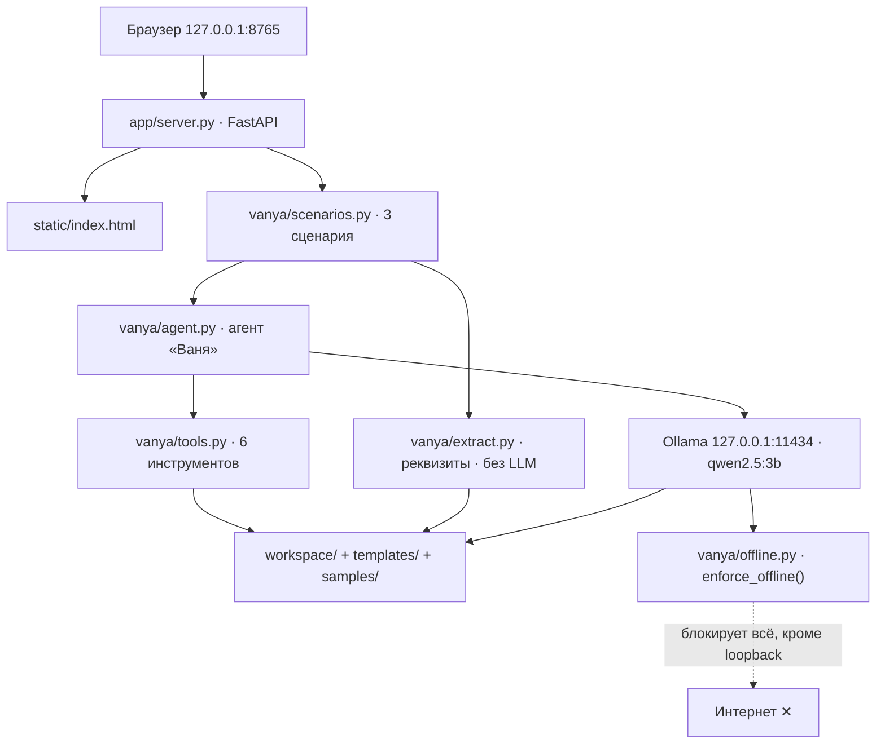

# Архитектура «Вани»

Единственный источник истины по устройству — `/home/hio/институт/акселетартор2026/SPEC.md`. Код собирается по нему, статус — «MVP в сборке». Ниже — как устроено приложение по замороженному SPEC.

## Три слоя

Приложение собирается вокруг трёх слоёв, лежащих в `/home/hio/институт/акселетартор2026/`:

- **`vanya/`** — ядро. Конфиг, офлайн-режим, работа с LLM, чтение документов, извлечение реквизитов, инструменты, агент, сценарии, промпты.
- **`app/`** — веб-слой. FastAPI-сервер (`server.py`) и одна статичная страница `static/index.html`.
- **`scripts/`** — вспомогательные скрипты: `check_ram.py`, `make_template.py`, `demo_data.py`.

Отдельно от кода лежат данные и результаты:

- `templates/dogovor_template.docx` — шаблон договора с плейсхолдерами `{{...}}`.
- `samples/` — тестовый пакет документов (`01_pasport_vypiska.txt`, `02_rekvizity_ooo.txt`, `03_dogovor_riski.txt`).
- `workspace/` — рабочая папка пользователя, куда падают загруженные файлы и отчёты. Не входит в репозиторий, путь переопределяется через `VANYA_WORKSPACE`.

## Поток данных

Логика простая. Браузер открывает страницу на `127.0.0.1:8765`. FastAPI раздаёт статику и вызывает один из трёх сценариев из `scenarios.py`. Сценарии либо идут через агента «Ваня» (который сам решает, какие инструменты дёргать и когда спросить модель), либо напрямую в детерминированный `extract.py`.

## Строгий офлайн-режим

Функция `enforce_offline()` из `vanya/offline.py` патчит сетевые вызовы на уровне процесса: `connect()` и `getaddrinfo()` разрешены только для `127.0.0.1`, `localhost` и `::1`. Любая попытка выйти наружу поднимает `ConnectionError`. Вызывается из `run.sh` и из `app/server.py`, идемпотентна.

> [!IMPORTANT]
> Офлайн-режим включён по умолчанию (`VANYA_OFFLINE=true`). Единственное разрешённое сетевое соединение — это Ollama на loopback. Интернет приложению не нужен вообще, и даже если сеть есть, выйти наружу оно не сможет.

## Агент и 6 инструментов

Агент «Ваня» (`vanya/agent.py`) работает циклом: отправляет сообщение модели вместе с описанием инструментов, получает вызовы, выполняет их через `dispatch()`, добавляет результаты обратно в диалог, повторяет. Лимит — `max_steps = 6`, после чего отдаёт финальный ответ. Любая ошибка модели превращается в событие `error`, приложение не падает.

Инструментов ровно шесть, все описаны в `vanya/tools.py`:

| name | args | что делает |
|---|---|---|
| `list_files` | `{}` | список файлов в workspace `[{name, size, ext}]` |
| `read_document` | `{"filename": str}` | текст документа из workspace |
| `extract_requisites` | `{"filename": str}` | реквизиты из документа, детерминированно |
| `fill_contract` | `{"source_filename": str, "out_name": str?}` | извлекает реквизиты и заполняет `templates/dogovor_template.docx`, кладёт результат в workspace |
| `find_risks` | `{"filename": str}` | LLM-анализ рисков договора → `{"summary", "risks": [...]}` |
| `write_report` | `{"name": str, "content": str}` | сохраняет текстовый отчёт в workspace |

## Детерминированные сценарии без LLM

> [!tip]
> Часть продукта не зависит от модели вообще. `extract_requisites()` — это только регулярки и нормализация, никакого LLM. А значит, извлечение реквизитов и заполнение договора работают даже на машине, где модель не запускается. Модель нужна только для `find_risks` и вопросов по документу (`ask`), и для `find_risks` есть эвристический фолбэк, если LLM недоступна.

## Веб-API

`app/server.py` (FastAPI + uvicorn, порт из конфига `VANYA_PORT`, по умолчанию 8765) отдаёт такие эндпоинты:

| метод | путь | назначение |
|---|---|---|
| GET | `/` | `static/index.html` |
| GET | `/api/health` | состояние `{"ok", "model", "model_installed", "offline", "ollama", "workspace"}` |
| GET | `/api/files` | список файлов workspace |
| POST | `/api/upload` | multipart-загрузка файлов в workspace |
| POST | `/api/scenario/fill` | заполнение договора |
| POST | `/api/scenario/risks` | поиск рисков |
| POST | `/api/scenario/ask` | вопрос по документу |
| POST | `/api/chat` | SSE-поток событий агента |
| GET | `/api/download/{name}` | отдать файл из workspace |

Статика — одна страница `index.html` на чистом JS, без CDN и внешних шрифтов. Тёмно-серая тёплая палитра, крупные элементы, бейдж «🔌 Офлайн-режим» и имя модели.

## Дальше

Какая модель и почему именно она — [[02 Модель и железо]]. Как всё это запустить — [[03 Как запустить]].
